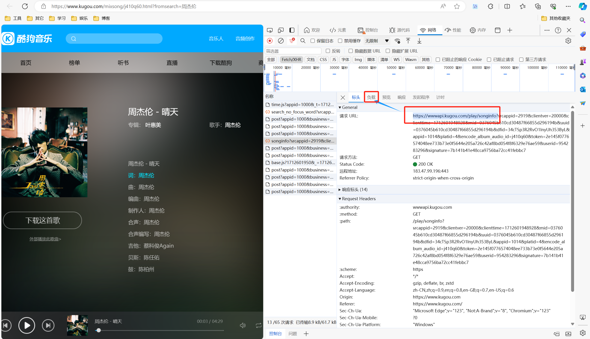
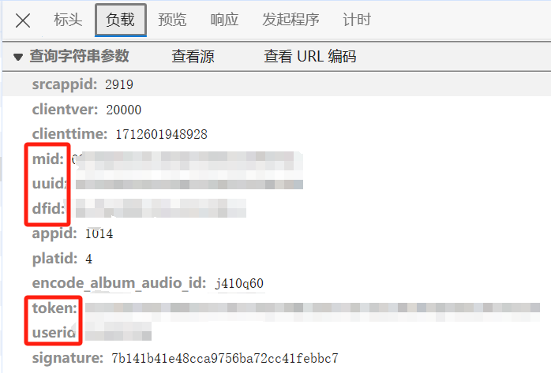
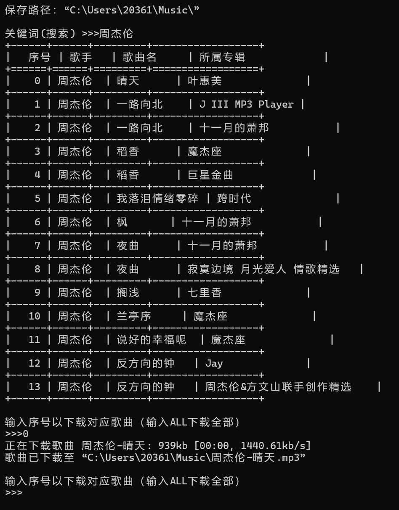

# 酷狗音乐破解

- 普通音质
- **需要酷狗会员账号**
- 使用*edge*浏览器抓包

## 1、抓包

*config.json*：

```json
{
    "path": "C:\\Users\\Crazysand\\Music\\",
    "mid": "",
    "uuid": "",
    "dfid": "",
    "token": "",
    "userid": "",
    "search_page_size": 30
}
```

- **`path`**：保存音乐的路径
- **`search_page_size`**：搜索的数量
- 其它都是*API*中的参数





1. 打开酷狗音乐，随便找一首[付费歌曲](https://www.kugou.com/mixsong/j410q60.html?fromsearch=%E5%91%A8%E6%9D%B0%E4%BC%A6)
2. 点击播放，*F12*抓包，类型选择*Fetch/XHR*
3. 找到**URL地址以`https://wwwapi.kugou.com/play/songinfo`开头**的数据包
4. 点击**负载**，复制五个参数到*config.json*

## 2、安装python依赖包

在**当前脚本目录下**打开终端命令行输入：

```
pip install -r requirement.txt -i https://pypi.tuna.tsinghua.edu.cn/simple
```

## 3、运行脚本

双击运行*main.py*

